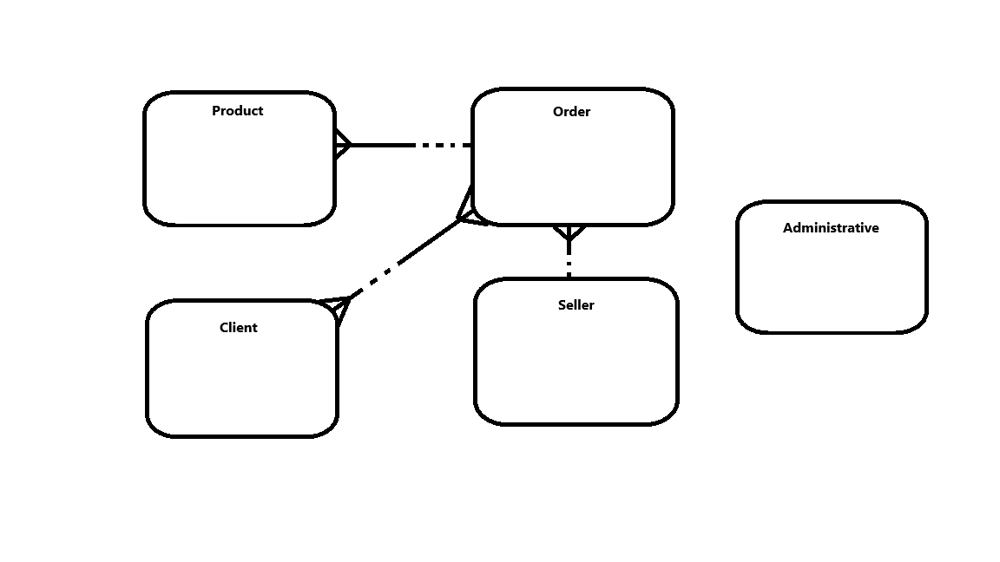
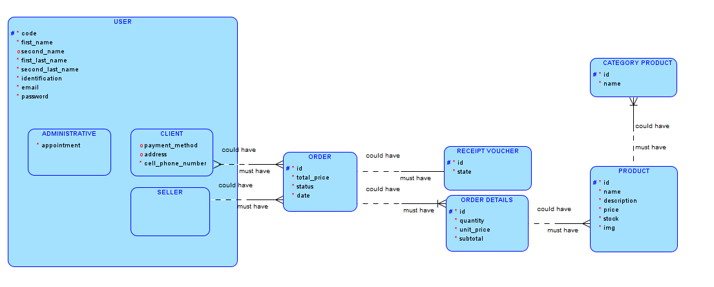
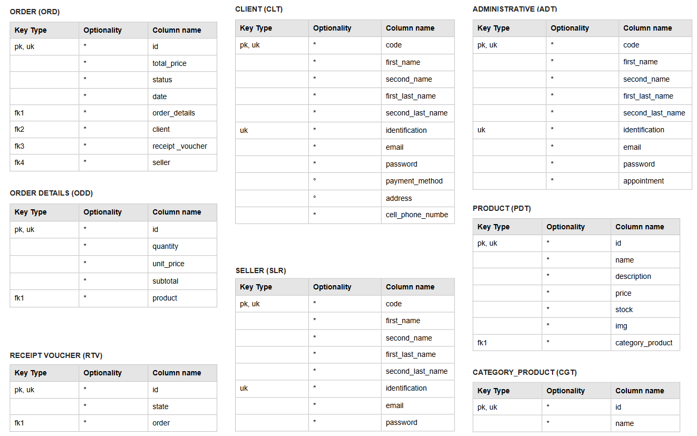
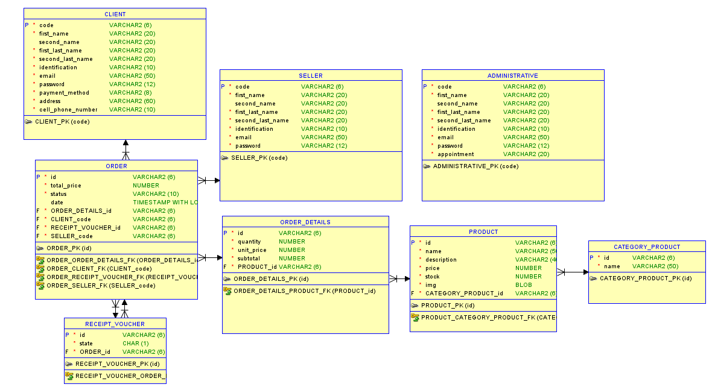

# Mini Ecommerce Web

Funcionalidades Principales

**Autenticación y Registro de Usuarios**  
**Gestión de Productos (CRUD)**  
**Creación y Administración de Pedidos**  
**Exportación de Pedidos en PDF**  
**Roles de Usuario: Administrador, Vendedor y Cliente**  

---

## Endpoints de la API

### Autenticación  
- `POST /auth/register` → Registro de nuevos usuarios  
- `POST /auth/login` → Inicio de sesión  

### Gestión de Usuarios  
- `GET /api/user` → Obtener lista de usuarios  

### Gestión de Categorías  
- `GET /api/categories` → Obtener categorías de productos  

### Gestión de Productos  
- `GET /tradicion/products` → Obtener lista de productos  
- `POST /tradicion/products` → Crear un nuevo producto  
- `PUT /tradicion/products/:id` → Actualizar un producto  
- `DELETE /tradicion/products/:id` → Eliminar un producto  

### Gestión de Pedidos  
- `GET /tradicion/order` → Obtener lista de pedidos  
- `POST /tradicion/order` → Crear un nuevo pedido  
- `PUT /tradicion/order/:id` → Actualizar estado del pedido  
- `DELETE /tradicion/order/:id` → Eliminar un pedido  
- 📄 **Exportación en PDF:** Permite generar un documento con el detalle del pedido  

## Documentación
## Objetivo General
Desarrollar un mini software web de ecommerce con un sistema de acceso, roles y dos módulos CRUD.

## Objetivos Específicos
- Implementar un sistema de autenticación y roles para gestionar el acceso de usuarios, diferenciando entre administradores, vendedores y clientes.
- Diseñar e implementar un módulo de productos donde los administradores y vendedores puedan agregar, modificar y eliminar productos del menú.
- Desarrollar un módulo de pedidos que permita a los clientes seleccionar productos, visualizar su carrito de compras y confirmar su orden.
- Incorporar un sistema de gestión de estados de pedidos, permitiendo a los administradores y vendedores actualizar su estado (pendiente, en preparación, entregado).
- Optimizar la experiencia de usuario en la interfaz web, utilizando React para el frontend y Node.js en el backend.
- Garantizar la persistencia de datos mediante una base de datos eficiente, que almacene información de usuarios, productos, pedidos y transacciones.
- Implementar un sistema de comprobantes de pago, permitiendo a los clientes adjuntar comprobantes en formato PDF o imagen.

## Descripción del negocio
**Tradición** es un café-restaurante enfocado en ofrecer productos artesanales con un toque casero, resaltando los sabores típicos de la región. Su menú incluye café de especialidad, postres caseros y platos tradicionales, permitiendo a los clientes disfrutar de una experiencia auténtica. A través de la plataforma de ecommerce, los clientes podrán explorar el menú, realizar pedidos en línea para recoger en tienda o solicitar entregas a domicilio.

## Requisitos de Información
### Funcionales
#### Autenticación
| ID | Requerimiento |
|----|--------------|
| 1  | Implementación de un sistema de autenticación basado en correo y contraseña |
| 2  | Solo los administradores pueden asignar y cambiar roles de usuario |
| 3  | Se deben manejar tres roles: Administrador, Vendedor y Cliente |

#### Módulo de Productos
| ID | Requerimiento |
|----|--------------|
| 1  | CRUD de productos (Crear, Leer, Actualizar, Eliminar) |
| 2  | Cada producto debe contener: Nombre, Descripción, Precio, Categoría, Stock e Imagen |
| 3  | Las imágenes deben almacenarse correctamente y ser accesibles desde la interfaz |

#### Módulo de Pedidos
| ID | Requerimiento |
|----|--------------|
| 1  | Los clientes pueden hacer pedidos seleccionando productos disponibles |
| 2  | Un pedido debe incluir: Lista de productos comprados, Cantidad de cada producto, Precio total, Estado del pedido y Comprobante de pago en PDF o imagen |
| 3  | Solo los administradores y vendedores pueden modificar el estado del pedido |

### No Funcionales
| ID | Requerimiento |
|----|--------------|
| 1  | Seguridad en el almacenamiento de contraseñas |
| 2  | Control de acceso según el rol del usuario |
| 3  | Validaciones de datos en formularios |

## Reglas del Negocio
| ID | Regla | Tipo |
|----|-------|------|
| 1  | Cada usuario debe registrarse con correo y contraseña | Estructural |
| 2  | Solo un administrador puede asignar roles | Procedimiento |
| 3  | Solo los administradores y vendedores pueden cambiar el estado del pedido | Procedimiento |
| 4  | Si un producto está agotado, no se puede añadir a un pedido | Estructural |
| 5  | El precio total del pedido se calcula automáticamente en base a los productos y sus cantidades | Estructural |
| 6  | Un cliente no puede realizar pedidos sin autenticarse | Estructural |
| 7  | Un producto no puede ser eliminado si está presente en un pedido en estado pendiente o enviado | Procedimiento |
| 8  | Un pedido no puede cambiar a enviado sin un comprobante de pago | Procedimiento |
| 9  | No se permite modificar un pedido después de haber sido entregado | Procedimiento |
| 10 | Los clientes pueden cancelar pedidos solo si el estado es pendiente | Procedimiento |

## Supuestos
| ID | Supuestos |
|----|----------|
| 1  | Se usará un sistema de almacenamiento en la nube o local para guardar imágenes y comprobantes de pago |
| 2  | Un cliente puede ver el historial de sus pedidos desde su cuenta |
| 3  | La autenticación será mediante correo y contraseña |


### Diagrama Conceptual  
Representa los conceptos principales del sistema y sus relaciones.
```md

```

### Diagrama Lógico  
Define las entidades y las relaciones entre ellas con más detalle.
```md

```
### Modelo de Tablas  
Muestra la estructura de las tablas en la base de datos.
```md

```

### Diagrama Físico  
Detalla cómo se implementarán las tablas en el sistema de base de datos.
```md

```